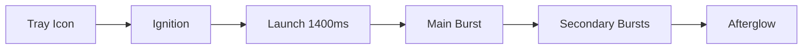
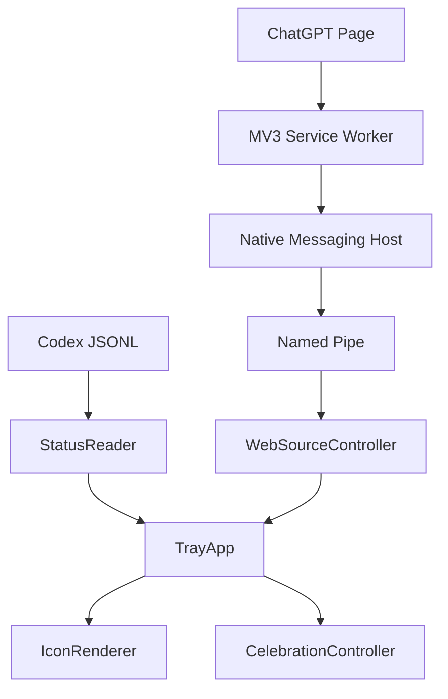

<!--
File purpose: Project homepage for English readers.
Scope: Describes features, usage, build, validation, and privacy boundaries.
Out of scope: Detailed event mapping, protocol internals, and phase history.
Maintenance: Keep this file concise and link detailed notes under docs/.
-->

# Codex Status Light

[中文](README.zh-CN.md) | English


Windows tray status indicator for Codex and ChatGPT Web tasks.

It merges local Codex JSONL sessions with optional ChatGPT Web state from a Chrome MV3 companion extension.

## Features

- Three-state tray light: waiting, running, completed.
- Priority: `Waiting > Completed > Running`.
- App and Browser source arcs on the tray icon.
- Left click opens Codex or focuses the related ChatGPT browser tab.
- Successful completions trigger tray-anchored fireworks.
- Firework audio is embedded in `StatusLight.exe`.
- No CDP port, localhost HTTP server, Node service, cookies, storage, or chat content transfer.

## Status Model

```text
Red     Waiting for human input   fast flash 3s, then steady
Amber   Running                   breathing animation
Green   Completed                 fast flash 1s, then short hold
```

The quota ring is independent from the center status color.

## Fireworks



Implemented effects:

- Real tray icon anchoring.
- Curved launch trail, shockwave, secondary bursts, and afterglow.
- Palettes: `GoldWhite`, `BlueGold`, `PurpleRose`.
- Height presets: normal, high, half screen.
- Burst presets: normal, large, very large.
- Randomized height and lateral drift.
- Concurrent fireworks for multiple completions.
- Background audio queue to avoid animation stalls.

## Web Companion

Location:

```text
extension\
```

Role:

- Runs only on ChatGPT pages.
- Detects page state: idle, running, waiting, terminal success, failure, or cancellation.
- Sends state snapshots to `StatusLight.exe` through Chrome Native Messaging.
- Receives focus commands from `StatusLight.exe` and activates the related Chrome tab.
- Provides a small popup for bridge status, reconnect, and extension diagnostics.

Use it when ChatGPT Web tasks should appear in the same tray indicator as local Codex tasks. It is not required for local Codex monitoring.

```text
Content Script
  -> Service Worker
  -> Chrome Native Messaging
  -> StatusLight.exe native host mode
  -> Named Pipe
  -> StatusLight.exe tray process
```

Native Host:

```text
com.statuslight.web
```

Development extension ID:

```text
pkaefmgibeeemjoilbpopeiffmkbnjoi
```

## Install

Release artifact:

```text
dist\StatusLight.exe
```

Release shape:

```text
dist contains only StatusLight.exe
Audio resources are embedded in the exe
Runtime: Windows x64 GUI process
CRT: static /MT
```

Start tray mode:

```bat
dist\StatusLight.exe
```

Diagnostics:

```bat
dist\StatusLight.exe --status
dist\StatusLight.exe --inspect
dist\StatusLight.exe --self-test-web
```

## Enable Web Monitoring

1. Start `StatusLight.exe`.
2. Enable the web bridge from the tray menu.
3. Load `extension\` as an unpacked Chrome extension.
4. Confirm extension ID `pkaefmgibeeemjoilbpopeiffmkbnjoi`.
5. Open ChatGPT pages normally.
6. Use the extension popup only for bridge status and manual reconnect.

## Build

Requirements:

```text
Windows
MSVC x64
CMake
C++17
```

Build:

```bat
cmake -S . -B build -G "Visual Studio 15 2017 Win64"
cmake --build build --config Release
```

## Architecture



```text
src/             Windows tray app, state reader, renderer, web bridge
extension/       Chrome MV3 companion extension
resources/       Embedded binary resources
docs/            Protocol, event map, and implementation notes
```

## Validation

```bat
dist\StatusLight.exe --self-test-web
node --check extension\content\chatgpt-observer.js
node --check extension\content\state-detector.js
```

Self-test covers Native Host registration, pipe ping/pong, web tab deduplication, state aggregation, invalid observer cleanup, and firework trigger rules.

## Privacy

StatusLight transfers state signals only:

```text
running
waiting
terminal_success
tab identity
conversation identity for deduplication and focus
```

It does not transfer chat text, uploads, cookies, local storage, account tokens, or browser network traffic.

## More

- `docs\web-extension-protocol.md`
- `docs\chatgpt-dom-state-map.md`
- `docs\codex-event-map.md`
- `docs\celebration-fireworks.md`
- `docs\p4-release.md`
