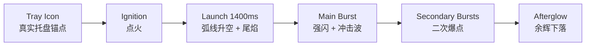
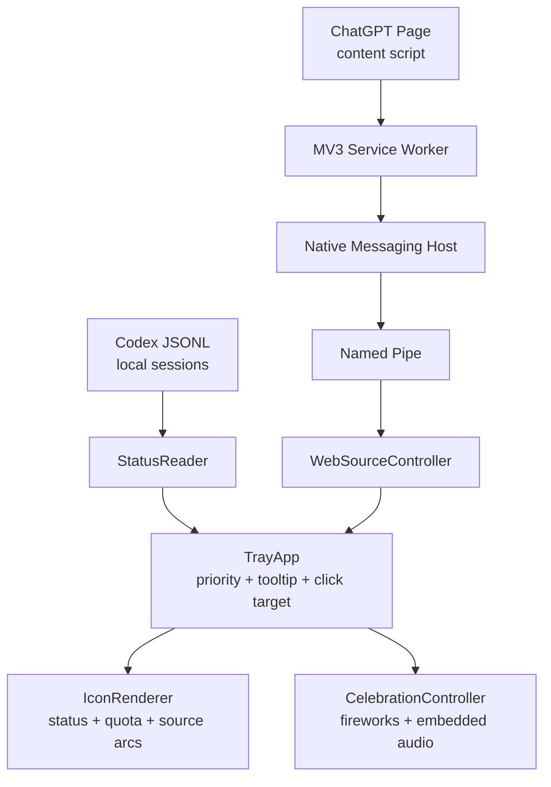

<!--
文件作用：说明 Codex Status Light 项目的定位、效果、安装构建和隐私边界
职责范围：
1. 面向开源首页展示功能、视觉状态和运行方式
2. 提供中英文并列说明，降低中文/英文用户理解成本
3. 记录当前发布形态、Web 扩展桥接和验证命令

不负责：
- 替代 docs 目录中的阶段设计、协议细节和事件取证文档
- 承诺未在当前代码中实现的平台、商店发布或跨浏览器能力

维护说明：
- README 应只描述已经落地的能力；协议字段和 DOM 细节变更时同步更新 docs。
-->

# Codex Status Light

> 一个贴在 Windows 托盘上的 Codex / ChatGPT Web 任务状态灯。
> A tiny Windows tray signal light for Codex and ChatGPT Web tasks.


Codex Status Light turns background AI work into a glanceable tray icon: red means human attention, amber means running, green means done. It can read local Codex session files and, with the companion Chrome extension, merge ChatGPT Web conversation state into the same indicator.

Codex Status Light 把后台 AI 任务变成一个一眼能看懂的托盘灯：红色表示需要人工介入，亮橙色表示正在运行，绿色表示完成。它既能读取本地 Codex 会话，也能通过配套 Chrome 扩展监听 ChatGPT 网页端，并把两边状态合并到同一个图标上。

## Highlights / 亮点

| Feature | English | 中文 |
| --- | --- | --- |
| Unified tray status | One icon summarizes local Codex and ChatGPT Web tasks. | 一个托盘图标同时汇总客户端和网页端任务。 |
| Priority model | Waiting overrides Completed, Completed overrides Running. | 人工介入优先，其次完成，最后运行中。 |
| Source markers | Inner arc markers show App / Browser task sources without text clutter. | 内圆弧标记区分客户端 / 浏览器来源，不增加文字噪音。 |
| Smart click target | Left click opens Codex or asks the extension to focus the matching Chrome tab. | 左键点击可打开 Codex，或跳到对应 ChatGPT 标签页。 |
| Firework celebration | Successful completions trigger tray-anchored fireworks with embedded audio. | 成功完成会在托盘附近播放烟花和内嵌音效。 |
| Privacy boundary | No chat content, cookies, storage, CDP port, localhost HTTP server, or Node runtime. | 不读取正文、Cookie、Storage；不依赖 CDP、localhost 服务或 Node 运行时。 |

## Visual Language / 状态视觉

```text
Red     Waiting for human input   快闪 3s，然后保持红色
Amber   Running                   亮橙色缓慢呼吸
Green   Completed                 快闪 1s，保留完成提示后自动让位
```

Priority:

```text
Waiting > Completed > Running
```

The quota ring is independent from the center status color. Source markers are drawn as compact inner arcs: App and Browser can both be visible when both sides have active prompts.

额度圆环独立于中心状态色。来源标记使用内圆弧显示；当客户端和浏览器同时有任务时，可以同时展示两个来源标记。

## Fireworks / 烟花效果

Successful completions are celebrated immediately, even if other tasks are still running. Multiple completions can launch multiple independent fireworks; they do not cancel each other.

成功完成会立即播放烟花，即使其他任务仍在运行。连续多个任务完成时会并发播放多个烟花，互不覆盖。



Implemented effects:

- Tray-anchored launch direction based on the real tray icon rectangle.
- Ignition, 1400ms launch, curved trail, main burst, shockwave, secondary bursts, and afterglow.
- Three visual palettes: `GoldWhite`, `BlueGold`, `PurpleRose`.
- Adjustable height: normal, high, half screen.
- Adjustable burst size: normal, large, very large.
- Slight random height and left/right drift so repeated fireworks do not look identical.
- Embedded MP3 explosion audio, packed into `StatusLight.exe` as Windows resources.
- Background audio queue so MCI playback does not block the animation frame.

已实现效果：

- 基于真实托盘图标位置发射，不猜测鼠标位置。
- 点火、1400ms 发射段、弧线尾焰、主爆炸、冲击波、二次爆点、余辉。
- 三套视觉主题：`GoldWhite`、`BlueGold`、`PurpleRose`。
- 高度可选：标准、高、半屏。
- 爆炸大小可选：标准、大、很大。
- 每次发射有轻微高度和左右漂移，连续播放不会机械重复。
- 爆炸 MP3 已作为 Windows 资源内嵌到 `StatusLight.exe`。
- 音频使用后台队列播放，避免爆炸前动画卡顿。

## Web Companion / 网页监听

The optional Chrome MV3 extension watches only ChatGPT browser pages. It reports structured state, not content.

可选的 Chrome MV3 扩展只监听 ChatGPT 网页端，并且只上报结构化状态，不上传对话内容。

Bridge path:

```text
Content Script
  -> Service Worker
  -> Chrome Native Messaging
  -> StatusLight.exe native host mode
  -> Named Pipe
  -> StatusLight.exe tray process
```

Native Host:

```text
com.statuslight.web
```

The development extension ID is fixed by `extension/manifest.json`:

```text
pkaefmgibeeemjoilbpopeiffmkbnjoi
```

What it does not use:

```text
No CDP remote debugging port
No localhost HTTP server
No Node.js background service
No cookies or browser storage reads
No chat message body transfer
```

## Install / 使用

Release artifact:

```text
dist\StatusLight.exe
```

Current release shape:

```text
dist contains only StatusLight.exe
Audio resources are embedded in the exe
Runtime: Windows x64 GUI process
CRT: static /MT
```

Start tray mode:

```bat
dist\StatusLight.exe
```

Useful diagnostics:

```bat
dist\StatusLight.exe --status
dist\StatusLight.exe --inspect
dist\StatusLight.exe --self-test-web
```

Optional Codex home override:

```bat
dist\StatusLight.exe --status --codex-home "D:\path\.codex"
```

## Enable ChatGPT Web Monitoring / 开启网页监听

1. Start `StatusLight.exe`.
2. Enable the web bridge from the tray context menu.
3. Load `extension\` as an unpacked Chrome extension.
4. Confirm Chrome shows extension ID `pkaefmgibeeemjoilbpopeiffmkbnjoi`.
5. Open ChatGPT pages normally; no CDP port is required.

中文步骤：

1. 启动 `StatusLight.exe`。
2. 在托盘右键菜单中启用网页桥接。
3. 在 Chrome 扩展管理页加载 `extension\` 解压扩展。
4. 确认扩展 ID 为 `pkaefmgibeeemjoilbpopeiffmkbnjoi`。
5. 正常打开 ChatGPT 页面即可监听，不需要开启 CDP 端口。

## Build / 构建

Requirements:

```text
Windows
MSVC x64
CMake
C++17
```

Release build:

```bat
cmake -S . -B build -G "Visual Studio 15 2017 Win64"
cmake --build build --config Release
```

The post-build step copies the executable to:

```text
dist\StatusLight.exe
```

## Architecture / 架构



```text
src/
  TrayApp.*                         tray UI, icon updates, prompt priority
  StatusReader.*                    local Codex JSONL session reader
  IconRenderer.*                    status icon, quota ring, source arcs
  celebration/                      tray-anchored firework animation and audio
  web/                              Native Messaging, pipe bridge, web aggregation

extension/
  content/                          ChatGPT DOM state detector and lifecycle hooks
  popup/                            bridge status and reconnect controls
  service-worker.js                 MV3 background bridge

resources/
  statuslight.rc                    embedded binary resources
  audio/                            source MP3 files compiled into the exe

docs/
  *.md                              protocol notes, event maps, phase records
```

## Validation / 验证

Recommended checks:

```bat
dist\StatusLight.exe --self-test-web
node --check extension\content\chatgpt-observer.js
node --check extension\content\state-detector.js
```

Covered by self-test:

- Native Host registration and pipe ping/pong.
- Web conversation deduplication across tabs.
- Waiting / running / completed aggregation.
- Invalid observer cleanup.
- Successful completion celebration trigger.
- Failed or cancelled completion does not trigger fireworks.
- Editing an old web prompt without a real running phase does not create a false completion.

## Documentation / 文档

- `docs\web-extension-protocol.md`: Native Messaging protocol.
- `docs\chatgpt-dom-state-map.md`: ChatGPT DOM state boundary.
- `docs\codex-event-map.md`: local Codex JSONL event mapping.
- `docs\celebration-fireworks.md`: firework implementation notes.
- `docs\p4-release.md`: release build facts.

## Privacy / 隐私边界

Codex Status Light is designed as a status indicator, not a content collector.

Codex Status Light 的目标是显示状态，不是采集内容。

It does not transfer:

- Chat message text.
- Uploaded files.
- Cookies.
- LocalStorage / IndexedDB values.
- Account tokens.
- Browser network traffic.

It transfers only task-state style signals such as `running`, `waiting`, `terminal_success`, tab identity, and conversation identity needed for deduplication and focus.

它只传输任务状态类信号，例如 `running`、`waiting`、`terminal_success`，以及用于去重和跳转的标签页 / 对话标识。
