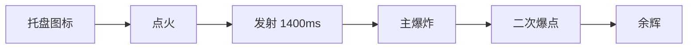
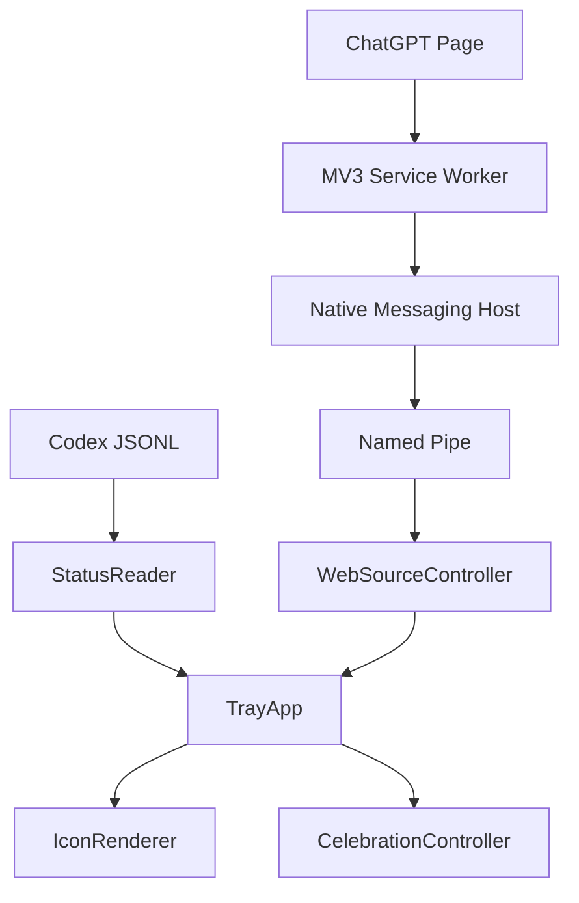

<!--
文件作用：项目中文首页。
职责范围：说明功能、使用、构建、验证和隐私边界。
不负责：事件映射、协议内部细节和阶段历史记录。
维护说明：保持简洁；详细设计放在 docs/。
-->

# Codex Status Light

中文 | [English](README.md)


Windows 托盘状态灯，用于显示 Codex 和 ChatGPT 网页端任务状态。

它会合并本地 Codex JSONL 会话，以及可选 Chrome MV3 扩展上报的 ChatGPT Web 状态。

## 功能

- 三色托盘状态：等待、运行、完成。
- 优先级：`等待 > 完成 > 运行`。
- 托盘图标内圆弧标记客户端和浏览器来源。
- 左键点击打开 Codex，或聚焦对应 ChatGPT 标签页。
- 成功完成触发托盘锚定烟花。
- 烟花音频内嵌在 `StatusLight.exe`。
- 不使用 CDP、localhost HTTP 服务、Node 后台服务；不读取 Cookie、Storage 或对话正文。

## 状态模型

```text
红色     等待人工介入     快闪 3s，然后保持
橙色     运行中           呼吸动画
绿色     已完成           快闪 1s，然后短暂保留
```

额度圆环独立于中心状态色。

## 烟花效果



已实现：

- 基于真实托盘图标锚定。
- 弧线升空、尾焰、冲击波、二次爆点和余辉。
- 主题：`GoldWhite`、`BlueGold`、`PurpleRose`。
- 高度：标准、高、半屏。
- 爆炸：标准、大、很大。
- 高度和左右漂移随机化。
- 多个完成任务可并发播放烟花。
- 后台音频队列，避免动画卡顿。

## 网页监听

位置：

```text
extension\
```

作用：

- 只在 ChatGPT 页面运行。
- 识别页面状态：空闲、运行、等待、成功、失败、取消。
- 通过 Chrome Native Messaging 把状态快照发送给 `StatusLight.exe`。
- 接收 `StatusLight.exe` 的聚焦命令，并激活对应 Chrome 标签页。
- 提供扩展弹窗，用于查看桥接状态、手动重连和诊断。

需要把 ChatGPT 网页端任务合并到同一个托盘状态灯时才需要安装该扩展。本地 Codex 监听不依赖扩展。

```text
Content Script
  -> Service Worker
  -> Chrome Native Messaging
  -> StatusLight.exe native host mode
  -> Named Pipe
  -> StatusLight.exe tray process
```

Native Host：

```text
com.statuslight.web
```

开发扩展 ID：

```text
pkaefmgibeeemjoilbpopeiffmkbnjoi
```

## 使用

发布产物：

```text
dist\StatusLight.exe
```

发布形态：

```text
dist 只包含 StatusLight.exe
音频资源已内嵌到 exe
运行时：Windows x64 GUI 进程
CRT：静态 /MT
```

启动托盘模式：

```bat
dist\StatusLight.exe
```

诊断命令：

```bat
dist\StatusLight.exe --status
dist\StatusLight.exe --inspect
dist\StatusLight.exe --self-test-web
```

## 开启网页监听

1. 启动 `StatusLight.exe`。
2. 在托盘菜单启用网页桥接。
3. 在 Chrome 加载 `extension\` 解压扩展。
4. 确认扩展 ID 为 `pkaefmgibeeemjoilbpopeiffmkbnjoi`。
5. 正常打开 ChatGPT 页面。
6. 扩展弹窗只用于查看桥接状态和手动重连。

## 构建

要求：

```text
Windows
MSVC x64
CMake
C++17
```

构建：

```bat
cmake -S . -B build -G "Visual Studio 15 2017 Win64"
cmake --build build --config Release
```

## 架构



```text
src/             Windows 托盘程序、状态读取、渲染、Web 桥接
extension/       Chrome MV3 配套扩展
resources/       内嵌二进制资源
docs/            协议、事件映射和实现说明
```

## 验证

```bat
dist\StatusLight.exe --self-test-web
node --check extension\content\chatgpt-observer.js
node --check extension\content\state-detector.js
```

自测覆盖 Native Host 注册、管道 ping/pong、网页多标签去重、状态聚合、失效 observer 清理和烟花触发规则。

## 隐私

StatusLight 只传输状态信号：

```text
running
waiting
terminal_success
标签页标识
用于去重和聚焦的对话标识
```

不传输对话正文、上传文件、Cookie、LocalStorage、账号令牌或浏览器网络流量。

## 更多文档

- `docs\web-extension-protocol.md`
- `docs\chatgpt-dom-state-map.md`
- `docs\codex-event-map.md`
- `docs\celebration-fireworks.md`
- `docs\p4-release.md`
